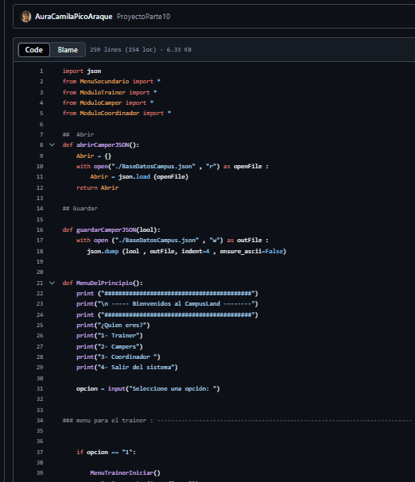

  

<!-- Sección de Presentación Animada -->
<h2 align="center" style="animation: bounce 2.5s infinite;">
  Hello people , I am Aura Camila 
  
</h2>

<h3 align="center" style="animation: pulse 3s infinite;">
  💡 "Escribo código con café, música y muchas ganas de mejorar"
</h3>

<!-- Sección Sobre Mí -->
##  Sobre Mí

Desarrolladora de software apasionada por crear soluciones innovadoras. Actualmente enfocada en el desarrollo web y bases de datos. Me encanta aprender nuevas tecnologías y colaborar en proyectos desafiantes.

<!-- Sección de Contacto con Animación -->
##  Contáctame

  
  
  
  

<!-- Sección de Estadísticas con Animación -->
##  Mis Estadísticas

  <!-- Estadísticas Generales -->
  

    <h3 align="center">
       
      Generales
    </h3>
    
  

  <!-- Lenguajes Principales -->
  

    <h3 align="center">
       
      Lenguajes
    </h3>
    
  

  <!-- Racha de Contribuciones -->
  

    <h3 align="center">
       
      Racha
    </h3>
    
  

  <!-- Detalles de Perfil -->
  

    <h3 align="center">
       
      Detalles
    </h3>
    
  

<!-- Sección de Habilidades con Texto Descriptivo -->
##  Tecnologías y Habilidades

  <!-- Frontend -->
  

    <h3 style="display: flex; align-items: center; justify-content: center; gap: 8px;">
      
      Frontend
    </h3>
    

      Desarrollo interfaces interactivas y responsivas con las últimas tecnologías web.
    

    

      

        
      

      

        
      

      

        
      

      

        
      

    

  

  <!-- Backend -->
  

    <h3 style="display: flex; align-items: center; justify-content: center; gap: 8px;">
      
      Backend
    </h3>
    

      Construyo la lógica del servidor y APIs robustas para aplicaciones escalables.
    

    

      

        
      

    

  

  <!-- Bases de Datos -->
  

    <h3 style="display: flex; align-items: center; justify-content: center; gap: 8px;">
      
      Bases de Datos
    </h3>
    

      Diseño y gestiono estructuras de datos eficientes para almacenamiento y consulta.
    

    

      

        
      

    

  

  <!-- Herramientas -->
  

    <h3 style="display: flex; align-items: center; justify-content: center; gap: 8px;">
      
      Herramientas
    </h3>
    

      Flujo de trabajo optimizado con las mejores herramientas de desarrollo.
    

    

      

        
      

      

        
      

      

        
      

    

  

<!-- Sección de Proyectos con Efecto Hover -->
##  Proyectos Destacados

  
  <!-- Proyecto 1 -->
  

    <h3 align="center">
     Formula 1</h3>
    

      
      
<strong>Sitio interactivo para explorar información de la Fórmula 1.</strong>

      
Tecnologías: HTML, CSS, JavaScript

      
    

  

  
  <!-- Proyecto 2 -->
  

    <h3 align="center"> Kario Media</h3>
    

      
      
<strong>Plataforma web para una consultora digital.</strong>

      
Tecnologías: Bootstrap, HTML, CSS

      
    

  

  
  <!-- Proyecto 3 -->
  

    <h3 align="center"> BaseDatosCampusLand</h3>
    

      
      
<strong>Sistema de gestión de base de datos para CampusLand.</strong>

      
Tecnologías: Python, SQL

      
    

  

  
  <!-- Proyecto 4 -->
  

    <h3 align="center">📂 Portafolio</h3>
    

      
<strong>Portafolio personal de proyectos desarrollados.</strong>

      
Tecnologías: HTML, CSS, JavaScript

      
    

  

<!-- Sección de Actividad con Animación -->
##  Mi Actividad

  

<!-- Sección de Logros con Animación -->
##  Logros

  

<!-- Sección de Frase Inspiradora Animada -->
##  Reflexión del Día

  <i style="font-size: 1.1em;">"El código es poesía lógica que da vida a las ideas. Cada línea es un paso hacia la solución."</i>

<!-- Footer Animado -->

  

<!-- Estilos CSS para las animaciones -->

